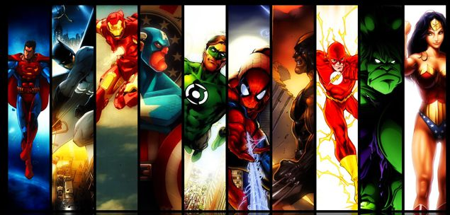

# NG Heroes 

## About 
This project is a recreation CRUD system. There´s an API of more than 700 heroes names and data and with this data the user is able to choose its 5 favorites characters, it will create a list of them, set a name for the "squad" and insert its own name. 

## About the Developers
We are in the 6th week of the Ironhack´s bootcamp WebDev56 in 2021. The goal of this project is running all the CRUD properties. 

## Start now!
[Click here](https://ngheroes.netlify.app/) for start.

## Find out more about this project
[Click here](https://docs.google.com/presentation/d/e/2PACX-1vQ3clMluDjuytIZZkM2Czv6V2gZDh7M5klwpIGF_ibL7ArlHP8vw-YByFJGUbtdMZHL608gy0-qrWgX/pub?start=false&loop=false&delayms=60000&slide=id.gec1066e1e3_0_636 )

  

